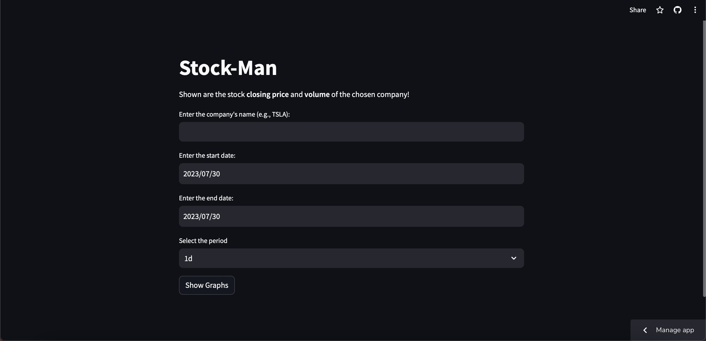

## Overview

Stock-Man is a web application built using Streamlit to display the closing price and volume of Google's stock. The app retrieves historical stock data using the Yahoo Finance API and presents it in interactive line charts.

## Live Demo

You can access the live demo of the app at [https://stock-man.streamlit.app](https://stock-man.streamlit.app)

## Features

- Display of Company's stock **closing price** and **volume** in interactive line charts.
- Interactive date range selection for historical data.
- Responsive and user-friendly interface.
- Major Holders Accounts
